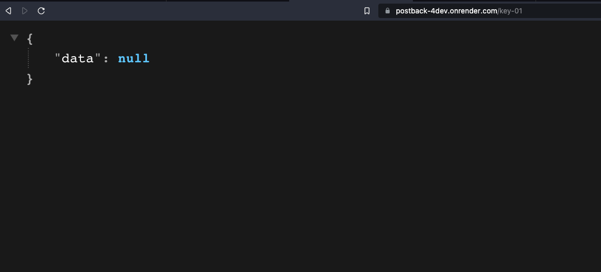
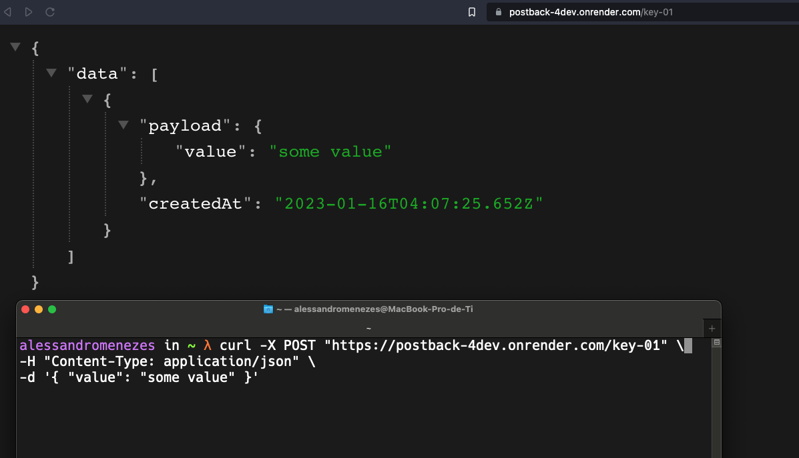

# Post Back Testing

A simple way to test your post back

- Testing if api is online

```sh

$ curl https://postback-4dev.onrender.com

```

- Call the public end point to save your data
- Provide any string as param to identify your temp database
- Body must be json object

```sh

$ curl -X POST https://postback-4dev.onrender.com/your-id \
-H "Content-Type: application/json" \
-d '{ "data": "hello world" }'

```

- Provide your key to get the data.
- It will be available for only 5 minutes

```sh

$ curl https://postback-4dev.onrender.com/your-id

```

---

## Example:

### Before call end-point. Data is null

In this example, the key "key-01" was used, but you can use any value.



### After call end-point with data

So we are pretty sure the postback was called.



> If you call the "endpoint" with the same id multiple times, all data will be stored in the same temp database.
